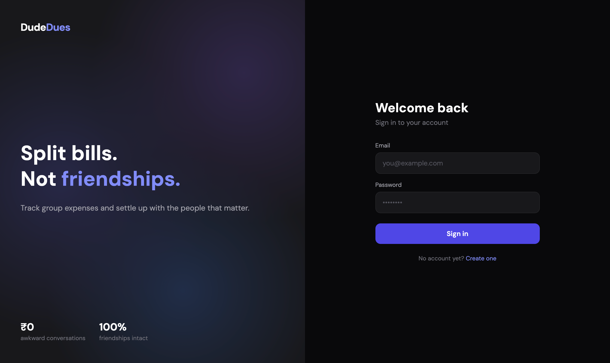
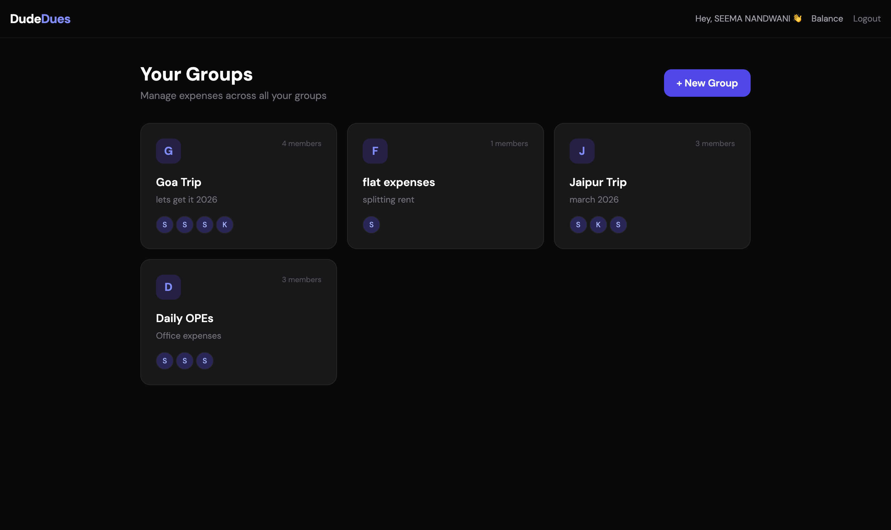
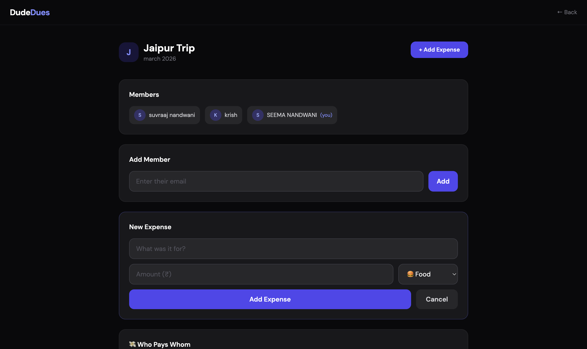
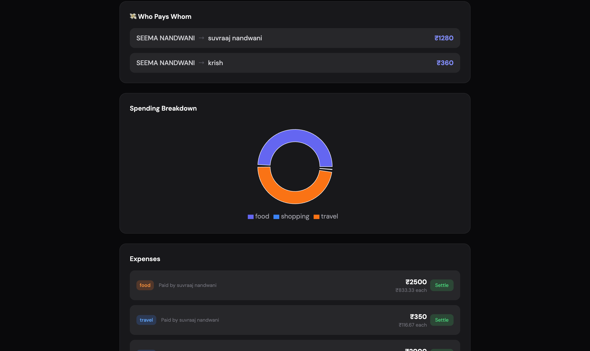
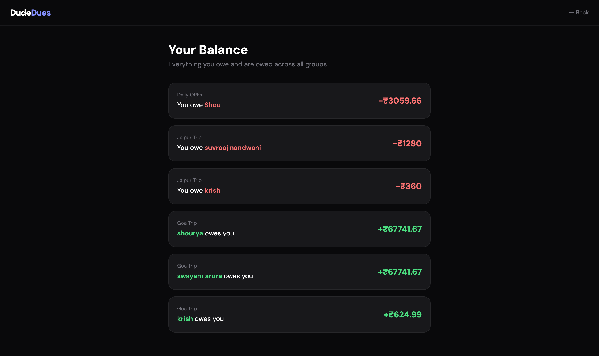

# DudeDues 

**Split bills. Not friendships.**

A full-stack expense splitting app that helps groups track shared expenses and calculates the minimum number of transactions needed to settle up.

🌐 **Live Demo:** [dude-dues.vercel.app](https://dude-dues.vercel.app)

> ⚠️ Backend is hosted on Render free tier — first request may take up to 50 seconds to wake up.

---

## Features

-  JWT-based authentication (signup/login)
-  Create groups and add members by email
-  Add expenses with categories (food, travel, rent, shopping, general)
-  Smart settlement algorithm — minimizes number of transactions to settle a group
-  Spending breakdown chart powered by Recharts
-  Balance page — see what you owe and are owed across ALL groups
-  Mark individual splits as settled
-  Responsive design for mobile and desktop

---

## Tech Stack

**Frontend**
- React + Vite
- Tailwind CSS
- Recharts
- Axios
- React Router

**Backend**
- Node.js + Express
- MongoDB + Mongoose
- JSON Web Tokens (JWT)
- bcryptjs

**Deployment**
- Frontend → Vercel
- Backend → Render
- Database → MongoDB Atlas

---

## Architecture

This project follows the **MVC pattern**:

- **Models** — Mongoose schemas for Users, Groups, and Expenses
- **Controllers** — Business logic for auth, groups, expenses, and settlements
- **Routes** — Express routers connecting HTTP methods to controllers
- **Middleware** — JWT verification middleware that protects private routes

### JWT Auth Flow
1. User signs up → password hashed with bcrypt → JWT token returned
2. Token stored in localStorage on frontend
3. Every request attaches token via Axios interceptor
4. `verify_authentication` middleware checks token before protected routes

### Settlement Algorithm
1. Calculate net balance for each member (total paid − total owed)
2. Separate members into creditors (positive balance) and debtors (negative balance)
3. Use a two-pointer approach to match debtors with creditors
4. Result: minimum possible transactions to fully settle the group

This reduces what could be O(n²) payments between n people down to at most n-1 transactions.

---

## Local Setup
```bash
# Clone the repo
git clone https://github.com/SUVRAAJ/DUDE_DUES.git

# Backend
cd server
npm install
# Create .env with MONGO_URI, JWT_SECRET, PORT=3000
node index.js

# Frontend
cd client
npm install
npm run dev
```

---

## Screenshots

### Login Page



### Dashboard



### Group Detail Page



### Who Pays Whom



### Balances Page



---

## Author

**Suvraaj Nandwani**  
3rd year CS student